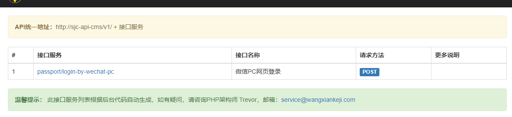
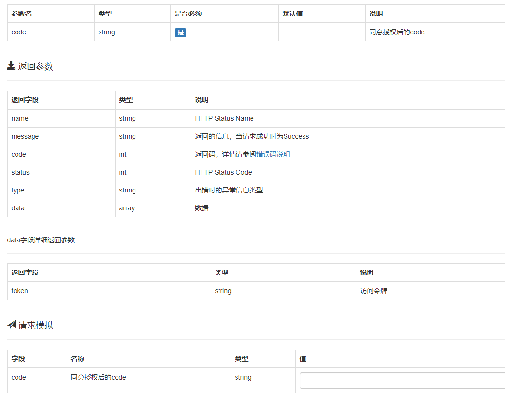

<p align="center">
    <a href="https://github.com/yiisoft" target="_blank">
        
    </a>
    <h1 align="center">Yii2 Annotations Generate API Document Extension</h1>
    <br>
</p>

[](//packagist.org/packages/zhuzixian520/yii2-api-doc) 
[](//packagist.org/packages/zhuzixian520/yii2-api-doc) 
[](//packagist.org/packages/zhuzixian520/yii2-api-doc) 
[](//packagist.org/packages/zhuzixian520/yii2-api-doc)
[](//packagist.org/packages/zhuzixian520/yii2-api-doc)
[](//packagist.org/packages/zhuzixian520/yii2-api-doc)

yii2-api-doc
============
通过对yii2的代码注释方便地生成在线api文档

安装
------------

安装此扩展的首选方式是通过 [composer](http://getcomposer.org/download/).

或者运行

```
composer require --prefer-dist zhuzixian520/yii2-api-doc "*"
```

或者添加

```
"zhuzixian520/yii2-api-doc": "*"
```

到你的`composer.json`文件中的 require 的部分，然后运行
```
composer install
```

用法
-----

一旦扩展安装，只需在您的代码中这样使用它:

```php
return [
    'modules' => [
        'api_doc' => [
            'class' => 'zhuzixian520\api_doc\Module',
            'hostApiDev' => 'http://api-dev.demo.com',//开发环境接口主机地址
            'hostApiProd' => 'http://api.demo.com',//生产环境接口主机地址
            'hostApiTest' => 'http://api-test.demo.com',//测试环境接口主机地址
            'author' => 'Trevor',
            'email' => 'service@wangxiankeji.com',
            'logo_src' => '/img/logo_64_64.png',//web目录下
            'icp_num' => '粤ICP备15025495号',
            'copyright_website' => 'http://www.sijiche.com',
            'company_start_year' => '2015',
        ],
        'v1' => [
            'class' => 'api\modules\v1\V1Module',
        ],
    ],
];
```

接口中控制器代码注释
```php
class PassportController extends yii\rest\Controller
{
    /**
     * 微信PC网页登录
     * @method POST
     * @token 0
     * @param string code 同意授权后的code 是
     * @res string token 访问令牌
     * @return array
     */
    public function actionLoginByWechatPc(): array {}
}
```
输出结果





访问接口文档地址

_类似gii与debug，你也可以修改参数V，来切换接口版本_

`
http://yourhost/api_doc?v=1
`


联系作者

邮箱：zhuzixian520@126.com